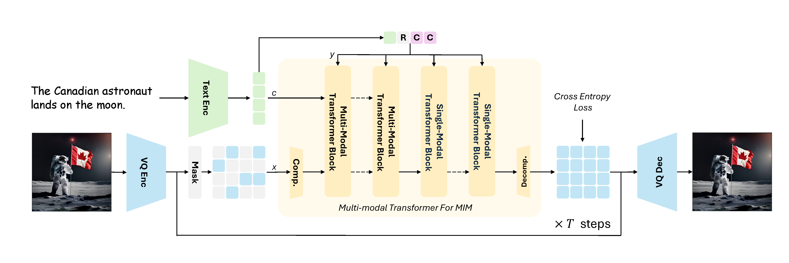

# Meissonic: Revitalizing Masked Generative Transformers for Efficient High-Resolution Text-to-Image Synthesis

<div align="center">


[](https://arxiv.org/abs/2410.08261)
[](https://huggingface.co/MeissonFlow/Meissonic)
[](https://github.com/viiika/Meissonic)
[](https://www.youtube.com/watch?v=PlmifElhr6M)
[](https://www.youtube.com/watch?v=rJDrf49wF64)
[](https://huggingface.co/spaces/MeissonFlow/meissonic)
[](https://replicate.com/chenxwh/meissonic)

[](https://huggingface.co/Collov-Labs/Monetico)
[](https://huggingface.co/spaces/Collov-Labs/Monetico)

[](https://arxiv.org/abs/2411.10781)

[](https://arxiv.org/abs/2503.15457)
[](https://huggingface.co/Yuanzhi/DiMO)
[](https://github.com/yuanzhi-zhu/DiMO)


[](https://arxiv.org/abs/2505.23606)
[](https://huggingface.co/MeissonFlow/Muddit)
[](https://github.com/M-E-AGI-Lab/Muddit)
[](https://huggingface.co/spaces/MeissonFlow/muddit)

[](https://arxiv.org/abs/2507.04947)

[](https://arxiv.org/abs/2508.10684)

[](https://arxiv.org/abs/2509.19244)
[](https://arxiv.org/abs/2509.23919)
[](https://arxiv.org/abs/2509.25171)

[](https://arxiv.org/abs/2510.06308)

[](https://arxiv.org/abs/2510.20668) [](https://github.com/M-E-AGI-Lab/Awesome-World-Models)

</div>

## 📝 Meissonic Updates and Family Papers

- [MaskGIT: Masked Generative Image Transformer](https://arxiv.org/abs/2202.04200) [CVPR 2022]
- [Muse: Text-To-Image Generation via Masked Generative Transformers](https://arxiv.org/abs/2301.00704) [ICML 2023]
- [🌟][Meissonic: Revitalizing Masked Generative Transformers for Efficient High-Resolution Text-to-Image Synthesis](https://arxiv.org/abs/2410.08261) [ICLR 2025]
- [Bag of Design Choices for Inference of High-Resolution Masked Generative Transformer](https://arxiv.org/abs/2411.10781)
- [Di[𝙼]O: Distilling Masked Diffusion Models into One-step Generator](https://arxiv.org/abs/2503.15457) [ICCV 2025]
- [🌟][Muddit: Liberating Generation Beyond Text-to-Image with a Unified Discrete Diffusion Model](https://arxiv.org/abs/2505.23606)
- [DC-AR: Efficient Masked Autoregressive Image Generation with Deep Compression Hybrid Tokenizer](https://arxiv.org/pdf/2507.04947) [ICCV 2025]
- [MDNS: Masked Diffusion Neural Sampler via Stochastic Optimal Control](https://arxiv.org/abs/2508.10684)
- [Lavida-O: Elastic Large Masked Diffusion Models for Unified Multimodal Understanding and Generation](https://arxiv.org/abs/2509.19244)
- [🌟][Lumina-DiMOO: An Omni Diffusion Large Language Model for Multi-Modal Generation and Understanding](https://arxiv.org/abs/2510.06308)
- [Token Painter: Training-Free Text-Guided Image Inpainting via Mask Autoregressive Models](https://arxiv.org/abs/2509.23919)
- [TR2-D2: Tree Search Guided Trajectory-Aware Fine-Tuning for Discrete Diffusion](https://arxiv.org/abs/2509.25171)
- [OneFlow: Concurrent Mixed-Modal and Interleaved Generation with Edit Flows](https://arxiv.org/abs/2510.03506)
- [Diffuse Everything: Multimodal Diffusion Models on Arbitrary State Spaces](https://arxiv.org/abs/2506.07903) [ICML 2025]
- [Towards Better & Faster Autoregressive Image Generation: From the Perspective of Entropy](https://arxiv.org/abs/2510.09012) [NeurIPS 2025]
- [🌟][From Masks to Worlds: A Hitchhiker's Guide to World Models](https://arxiv.org/abs/2510.20668)
- [Soft-Di[M]O: Improving One-Step Discrete Image Generation with Soft Embeddings](https://arxiv.org/abs/2509.22925)
- More papers are coming soon!
See [MeissonFlow Research](https://huggingface.co/MeissonFlow) (Organization Card) for more about our vision.


## 🚀 Introduction

Meissonic is a non-autoregressive mask image modeling text-to-image synthesis model that can generate high-resolution images. It is designed to run on consumer graphics cards.



**Key Features:**
- 🖼️ High-resolution image generation (up to 1024x1024)
- 💻 Designed to run on consumer GPUs
- 🎨 Versatile applications: text-to-image, image-to-image

## 🛠️ Prerequisites

### Step 1: Clone the repository
```bash
git clone https://github.com/viiika/Meissonic/
cd Meissonic
```

### Step 2: Create virtual environment
```bash
conda create --name meissonic python
conda activate meissonic
pip install -r requirements.txt
```

### Step 3: Install diffusers
```bash
git clone https://github.com/huggingface/diffusers.git
cd diffusers
pip install -e .
```

## 💡 Inference Usage

### Gradio Web UI

```bash
python app.py
```

### Command-line Interface

#### Text-to-Image Generation

```bash
python inference.py --prompt "Your creative prompt here"
```

#### Inpainting and Outpainting

```bash
python inpaint.py --mode inpaint --input_image path/to/image.jpg
python inpaint.py --mode outpaint --input_image path/to/image.jpg
```

### Advanced: FP8 Quantization

Optimize performance with FP8 quantization:

Requirements:
- CUDA 12.4
- PyTorch 2.4.1
- TorchAO

Note: Windows users install TorchAO using
```shell
pip install --pre torchao --index-url https://download.pytorch.org/whl/nightly/cpu
```

Command-line inference
```shell
python inference_fp8.py --quantization fp8
```

Gradio for FP8 (Select Quantization Method in Advanced settings)
```shell
python app_fp8.py
```

#### Performance Benchmarks

| Precision (Steps=64, Resolution=1024x1024) | Batch Size=1 (Avg. Time) | Memory Usage |
|-------------------------------------------|--------------------------|--------------|
| FP32                                      | 13.32s                   | 12GB         |
| FP16                                      | 12.35s                   | 9.5GB        |
| FP8                                       | 12.93s                   | 8.7GB        |

## 🎨 Showcase

<div align="center">
  
  <p><i>"A pillow with a picture of a Husky on it."</i></p>
</div>

<div align="center">
  
  <p><i>"A white coffee mug, a solid black background"</i></p>
</div>

## 🎓 Training

To train Meissonic, follow these steps:

1. Install dependencies:
   ```bash
   cd train
   pip install -r requirements.txt
   ```

2. Download the [Meissonic](https://huggingface.co/MeissonFlow/Meissonic) base model from Hugging Face.

3. Prepare your dataset:
   - Use the sample dataset: [MeissonFlow/splash](https://huggingface.co/datasets/MeissonFlow/lemon/resolve/main/0000.parquet)
   - Or prepare your own dataset and dataset class following the format in line 100 in [dataset_utils.py](./train/dataset_utils.py) and line 656-680 in [train_meissonic.py](./train/train_meissonic.py)
   - Modify [train.sh](./train/train.sh) with your dataset path

4. Start training:
   ```bash
   bash train/train.sh
   ```

Note: For custom datasets, you'll likely need to implement your own dataset class.


## 📚 Citation

If you find this work helpful, please consider citing:

```bibtex
@article{bai2024meissonic,
  title={Meissonic: Revitalizing Masked Generative Transformers for Efficient High-Resolution Text-to-Image Synthesis},
  author={Bai, Jinbin and Ye, Tian and Chow, Wei and Song, Enxin and Chen, Qing-Guo and Li, Xiangtai and Dong, Zhen and Zhu, Lei and Yan, Shuicheng},
  journal={arXiv preprint arXiv:2410.08261},
  year={2024}
}
```

## 🙏 Acknowledgements

We thank the community and contributors for their invaluable support in developing Meissonic. We thank apolinario@multimodal.art for making Meissonic [Demo](https://huggingface.co/spaces/MeissonFlow/meissonic). We thank @NewGenAI and @飛鷹しずか@自称文系プログラマの勉強 for making YouTube tutorials. We thank @pprp for making fp8 and int4 quantization. We thank @camenduru for making [jupyter tutorial](https://github.com/camenduru/Meissonic-jupyter). We thank @chenxwh for making Replicate demo and api. We thank Collov Labs for reproducing [Monetico](https://huggingface.co/Collov-Labs/Monetico). We thank [Shitong et al.](https://arxiv.org/abs/2411.10781) for identifying effective design choices for enhancing visual quality.


---

<p align="center">
  <a href="https://star-history.com/#viiika/Meissonic&Date">
    
  </a>
</p>

<p align="center">
  Made with ❤️ by the MeissonFlow Research
</p>
